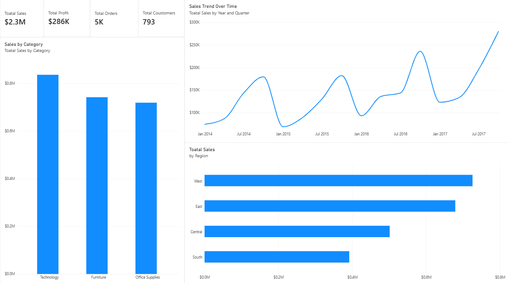
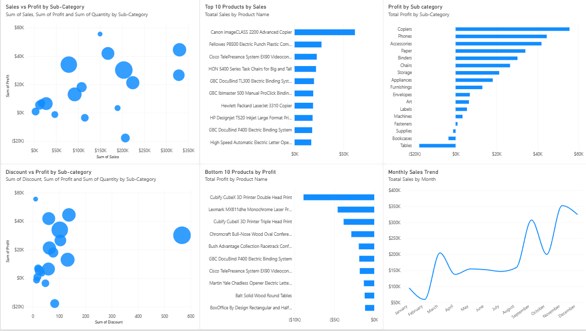
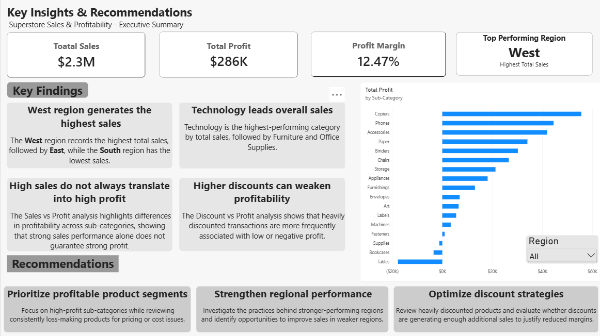

# Superstore Sales Analysis

Interactive Power BI dashboard analysing 10K+ retail transactions to uncover sales trends, profitability patterns, regional performance, product performance, and the impact of discounts.

## Tools Used

**Power BI · Power Query · DAX · Exploratory Data Analysis (EDA)**

## Dashboard

### Dashboard Overview

High-level view of key business metrics including **Total Sales, Total Profit, Total Orders, and Total Customers**, along with sales trends, category performance, and regional sales.

### Exploratory Analysis

Analysis of **Sales vs Profit, Discount vs Profit, Sub-Category profitability, Top Products, Bottom Performers**, and monthly sales trends.

### Key Insights & Recommendations

- **Technology** leads overall sales.
- The **West** is the top-performing region by sales.
- Profitability varies significantly across sub-categories.
- Higher discounts are frequently associated with weaker profitability.
- High sales do not always translate into high profit.

**Recommendations:** Prioritize profitable segments, review loss-making products, optimize discount strategies, and improve performance in weaker regions.

## Key Results

| Total Sales | Total Profit | Orders | Customers | Profit Margin |
| **$2.3M**   | **$286K**    | **5K** | **793**   | **12.47%**    |

## Repository Contents

- `Superstore-Sales-Analysis.pbix` — Power BI dashboard
- `Superstore.csv` — Source dataset
- Dashboard screenshots

---

Built using **Power BI, Power Query, DAX, and Exploratory Data Analysis**.
